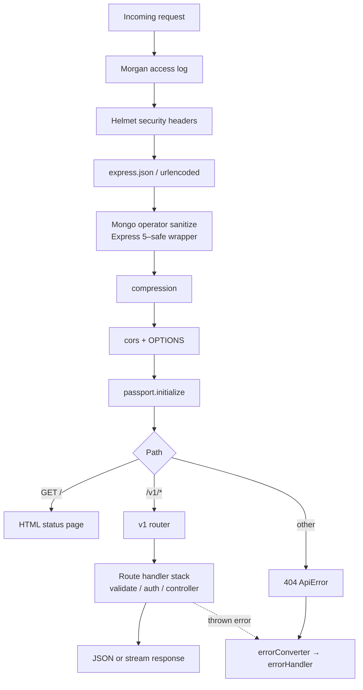
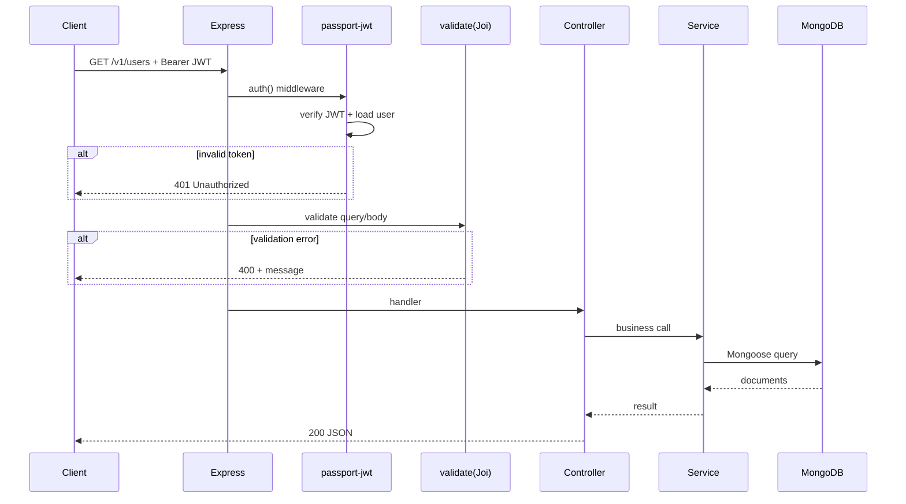

# Request flow

End-to-end **HTTP lifecycle** inside the Express app: middleware order, routing, and error path.

## Middleware order (global)

Order is defined in `src/app.js` (top to bottom). Simplified:

### Why order matters

1. **Body parsers** must run before anything that reads `req.body`.
2. **Sanitization** runs after parsing so it can walk objects safely.
3. **Passport** runs before `/v1` so JWT strategy is available to `auth()` on routes.
4. **404** is a bare middleware after `/v1` — only unmatched paths hit it.
5. **Errors** go through `errorConverter` (normalize to `ApiError`) then `errorHandler` (JSON payload, status code).

## Authenticated route (conceptual sequence)

## Errors and status codes

- Operational errors use **`ApiError`** with `statusCode` and `message`.
- Unknown errors are converted in **`errorConverter`** (`src/middlewares/error.js`): Mongoose validation-style errors map to **400**, others to **500** unless `statusCode` is already set.
- **`http-status`** is imported via `src/utils/httpStatus.js` so **v2** (`default` export) works correctly.

## Related

- [Source tree](./source-tree) — file-level map
- [Environment setup E2E](../procedures/environment-setup-e2e) — run the stack locally
