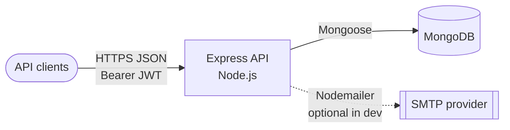
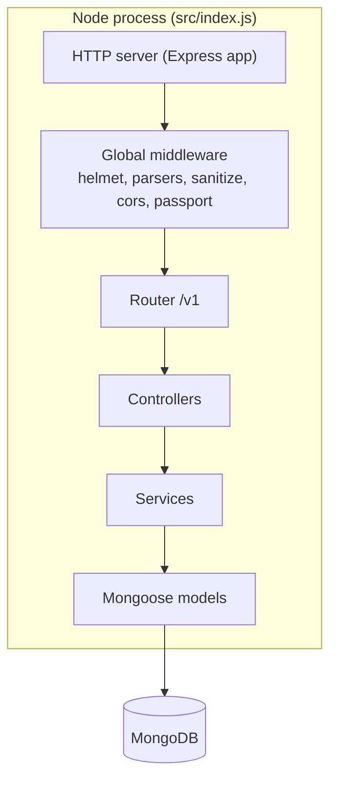

# System design

This page is the **architecture map** for the repository: what runs where, what depends on what, and where trust boundaries sit.

## Context (system view)

The API is a stateless Node process that talks to MongoDB and optional SMTP. Clients are browsers, mobile apps, or other backends.

### Plain-language context

| Actor / system  | Role                                                                                      |
| --------------- | ----------------------------------------------------------------------------------------- |
| **Client**      | Sends `Authorization: Bearer` for protected routes; JSON bodies for auth and CRUD.        |
| **Express API** | Validates input (Joi), applies auth (Passport JWT), runs controllers → services → models. |
| **MongoDB**     | Durable storage for users and refresh/reset/verify tokens.                                |
| **SMTP**        | Outbound email; failures are warned at startup but do not block HTTP listen.              |

## Container (process view)

## Configuration boundary

All runtime configuration flows through **`src/config/config.js`**:

1. Load `.env` via `dotenv`
2. **Joi** validates `process.env`
3. Exported object supplies `port`, `mongoose.url`, `jwt`, `email`, and `env`

Invalid env → process throws at startup (fail fast).

## Versioning and extension

| Concern           | Where it lives                                                          |
| ----------------- | ----------------------------------------------------------------------- |
| HTTP routes       | `src/routes/v1/**` — mount new routers in `routes/v1/index.js`          |
| OpenAPI / Swagger | `src/docs/*`, route comments in `*.route.js`, `docs.route.js`           |
| Auth rules        | `src/middlewares/auth.js`, `src/config/roles.js`                        |
| Rate limits       | `src/middlewares/rateLimiter.js`, wired in `app.js` for production auth |

Next: [Request flow](./request-flow) for per-request sequencing.
