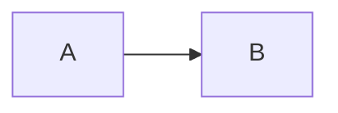

# Maintaining the documentation site

The **Docusaurus** project lives in **`website/`**. It is a separate Node package from the API.

## Install (first time or after clone)

```bash
cd website
npm install
```

## Edit content

- **Markdown / MDX files:** `website/docs/`
- **Sidebar order:** `website/sidebars.js` (explicit IDs map to `docs/<path>.md`)
- **Site metadata & navbar:** `website/docusaurus.config.js`
- **Homepage:** `website/src/pages/index.js` and `website/src/components/HomepageFeatures/index.js`
- **Styling:** `website/src/css/custom.css`

## Local preview

From `website/`:

```bash
npm run start
```

The dev server listens on **[http://localhost:4000](http://localhost:4000)** by default (`npm run start` in `website/package.json` passes `--port 4000`).

If something else already uses **4000**, pick another port:

```bash
npm run start -- --port 3001
```

Then open `http://localhost:3001`.

## Production build

```bash
cd website
npm run build
npm run serve
```

`serve` uses port **4000** by default (same as `start`).

Static output is written to **`website/build/`**, suitable for **Netlify**, **Vercel**, **GitHub Pages**, or any static host.

### GitHub Pages `baseUrl`

If the site is served from `https://<user>.github.io/<repo>/`, set in `docusaurus.config.js`:

```js
url: 'https://<user>.github.io',
baseUrl: '/<repo>/',
```

Rebuild after changing `baseUrl`.

## Mermaid diagrams

This site enables **`@docusaurus/theme-mermaid`**. Use fenced blocks:

````md

````

If a diagram fails to render after an upgrade, check [Docusaurus diagram docs](https://docusaurus.io/docs/markdown-features/diagrams).

## Broken links

`onBrokenLinks` is set to **`throw`** in `docusaurus.config.js`, so **`npm run build`** fails on dead internal links. Fix links before merging doc PRs.
